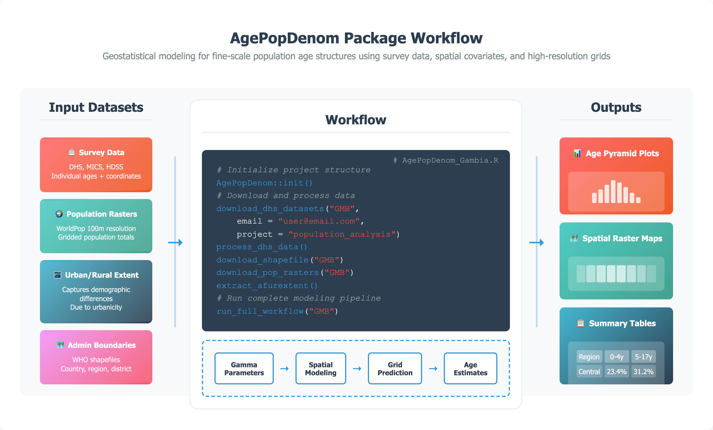

## Summary

`AgePopDenom` is an R package that generates spatial resolution (5 km × 5 km) estimates of population by single year of age across space using publicly available datasets including Demographic and Health Surveys (DHS) [@fabic2012], WorldPop gridded population data [@tatem2017worldpop], and administrative boundaries. It’s designed for settings where recent, detailed age data are missing or outdated, common in many low- and middle-income countries.

The package models age distributions using a Gamma distribution framework, which is well-suited for representing the typical shape of age structures (e.g., more children than elderly in most settings). It then predicts the distribution parameters across space using bivariate geostatistical models, which allow the model to estimate how age patterns vary jointly with location. To better reflect real-world patterns, the model incorporates spatial autocorrelation via Gaussian processes, which is a way of capturing the phenomenon where nearby locations tend to have similar demographic characteristics. Users can also include covariates, such as urban/rural status or other geographic features, to guide predictions. This approach moves beyond standard demographic methods by modeling age structure as a high resolution surface across geographies, capturing spatial heterogeneities, rather than assuming it is the same within large regions. As a result, AgePopDenom can produce detailed, spatially continuous age-disaggregated estimates, even in locations not directly sampled in surveys.

`AgePopDenom` is the first `R` package to operationalize a parameter-based geostatistical approach for modeling full age structures at fine spatial resolution (Figure 1). Unlike existing tools that focus on demographic simulation or a limited set of health indicators, `AgePopDenom` integrates survey microdata, gridded population rasters, administrative boundaries, and user-defined covariates into a single, streamlined workflow. It automates every step, from data acquisition and preprocessing to model fitting, spatial prediction, and visualization. The spatial modeling of age parameters is implemented using Template Model Builder (TMB) [@kristensen2016], an `R` package designed for fitting statistical latent variable models with efficient `C++`-based optimization. This approach reduces computation time to just 7–10 minutes per country, compared to the 2–3 hours typically required by conventional `R` methods.



## Statement of need

Accurate and spatially explicit age-structured population data are essential for public health planning, disease surveillance, and broader development efforts. Such data form the basis for estimates of disease burden, vaccination coverage, and intervention impact, aiding governments and organizations in allocating resources effectively [@tatem2014; @diaz2021; @hay2006]. Granular age-disaggregated data remain scarce however. Census data are infrequent and often lack subnational detail. National projections offer interim estimates, but their aggregate assumptions limit utility for local planning. Microdata from National Statistical Offices are often inaccessible due to restrictions [@linard2011; @stevens2015]. Household surveys such as those produced by the Demographic and Health Surveys (DHS) and Multiple Indicator Cluster Surveys (MICS) provide rich demographic data but are not designed for subnational estimation [@boerma1993; @ye2012]. This creates a persistent gap in small-area, age-structured population estimates.

Despite advances in fine-scale population modeling—particularly for total population and select age groups like under-fives [@stevens2015; @wardrop2018; @alegana2015; @pezzulo2017]—methods for estimating full age structures remain limited. Traditional techniques like spline interpolation [@mcneil1977; @fukuda2010] lack spatial detail and omit the potential benefits of incorporating covariates, while top-down census disaggregation often relies on outdated baselines, and bottom-up models typically exclude age [@wardrop2018]. AgePopDenom addresses this gap by modeling continuous age distributions via Gamma parameterization, using bivariate Gaussian processes to capture spatial autocorrelation. It delivers high-resolution estimates from survey microdata and covariates through a streamlined R workflow optimized with Template Model Builder (TMB) [@kristensen2016], with built-in uncertainty quantification.

Several existing R packages address adjacent topics but none support empirical, geostatistical modeling of full age structures. Simulation-oriented tools such as `IBMPopSim` [@giorgi2023efficient], `demogR` [@demogR], `demography` [@demography2024], `popdemo` [@stott2012popdemo], and `mpmsim` [@jones2025mpmsim] focus on cohort or matrix-based demographic modeling, rather than empirical spatial estimation. `SUMMER` [@summer2025] package supports small-area estimation of survey-based indicators, but is limited to specific outcomes like under-five mortality and does not model full age structures. Additonally, the `wpp2024` [@wpp2024] package, based on official UN model life table projections, provides standardized national age patterns but lacks spatial granularity and the ability to incorporate covariates.

## Key functionality

### Data Requirements

`AgePopDenom` accepts a flexible range of input data types, including:

- **Survey data**: Any household survey with geolocated cluster data can be used, provided it includes the variables latitude, longitude, ageyrs, and an urban/rural indicator. DHS data are natively supported and can be downloaded via the rdhs package.

- **Population rasters**: Typically from WorldPop (www.worldpop.org), offering 100m resolution estimates of residential population totals.

- **Urban/rural covariates**: Derived from satellite-derived nighttime lights, capturing settlement density and urbanization.

- **Administrative shapefiles**: WHO shapefiles or any user-provided file with standard fields such as `country`, `region`, and `district`.

Users may supply custom datasets if they conform to these structural expectations.

### Modeling Framework

Ages are modeled using a Gamma distribution for each survey cluster. Let $A_{ij}$ represent the age of the $j$-th individual in cluster $i$. Each $A_{ij}$ is assumed to follow a Gamma distribution with shape $\alpha(x_i)$ and scale $\lambda(x_i)$, estimated via maximum likelihood. That is, the Gamma distribution parameters are a function of a bivariate Gaussian Process ${x}$ with an exponential covariance function.

The fitted Gaussian process is used to generate predictions of the Gamma parameters at unobserved locations, capturing spatial correlation and allowing smooth interpolation across space. The Gamma cumulative distribution function is then applied to compute proportions in any defined age group, supporting fine-scale age-disaggregated estimation.

### Example

```r
# Note: It is essential to run this within an RStudio Project
# so that relative paths used in init() and subsequent steps work correctly

install.packages("AgePopDenom")
AgePopDenom::init()
AgePopDenom::download_dhs_datasets("GMB", email = "email@example.org", project = "demo")
AgePopDenom::process_dhs_data()
AgePopDenom::download_shapefile("GMB")
AgePopDenom::download_pop_rasters("GMB")
AgePopDenom::extract_afurextent()
AgePopDenom::run_full_workflow("GMB")
```

## Conclusion

`AgePopDenom` offers both a methodological advance and a practical tool for analysts and programs working across data-sparse settings. Using survey microdata and spatial covariates, it estimates Gamma-distribution parameters at the cluster level and interpolates them via Gaussian processes [@alegana2015] to generate continuous, spatially explicit age distributions. This parameter-based method complements traditional demographic approaches [@mcneil1977; @fukuda2010] by offering subnational resolution, covariate integration, and reproducible workflows [@linard2011; @james2018]. Future extensions will be focused on incorporating temporal dynamics [@ye2012], Bayesian frameworks [@rue2017], migration and fertility covariates, and support for longitudinal surveys. Still, the current implementation already fills a key gap by producing age-disaggregated estimates from routinely collected household survey data in data-sparsesettings. AgePopDenom provides a much-needed tool for generating detailed, policy-relevant age structures to support health and development planning.

## Acknowledgements

We acknowledge the DHS Program for providing access to survey data and WorldPop for gridded population datasets. This work was supported by funding from the World Health Organization and the University of Southampton.

## References
